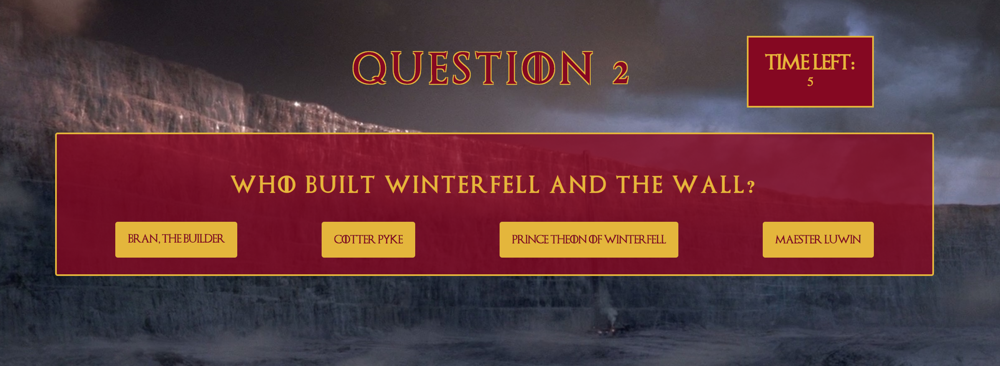

[<h1 align="center">👸 Game of Thrones Trivia 🤴</h1>](https://sashapatsel.github.io/got-trivia/)

[Game of Thrones Trivia](https://sashapatsel.github.io/got-trivia/) 

## Getting started

## Making the App

### Features

#### How it works

### Design

## Deployment

This site is deployed with github pages. You can view it [here](https://sashapatsel.github.io/got-trivia/).

If you are trying to replicate and deploy this porject on your own, please refer to the package.json to see how the build was run (the build compiles the sass code to css so that it can be read by browsers). 

## Built With

* HTML
* Sass
* JQuery

## Authors

* **Sasha Patsel** - *Initial work* - [Github](https://github.com/SashaPatsel/)

## License

This project is licensed under the MIT License - see the [LICENSE.md](LICENSE.md) file for details

